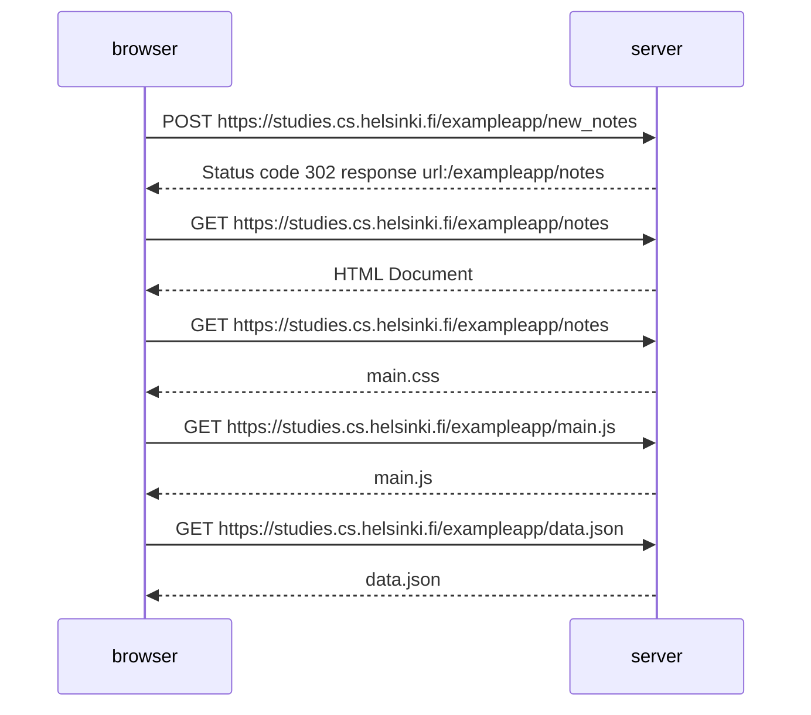
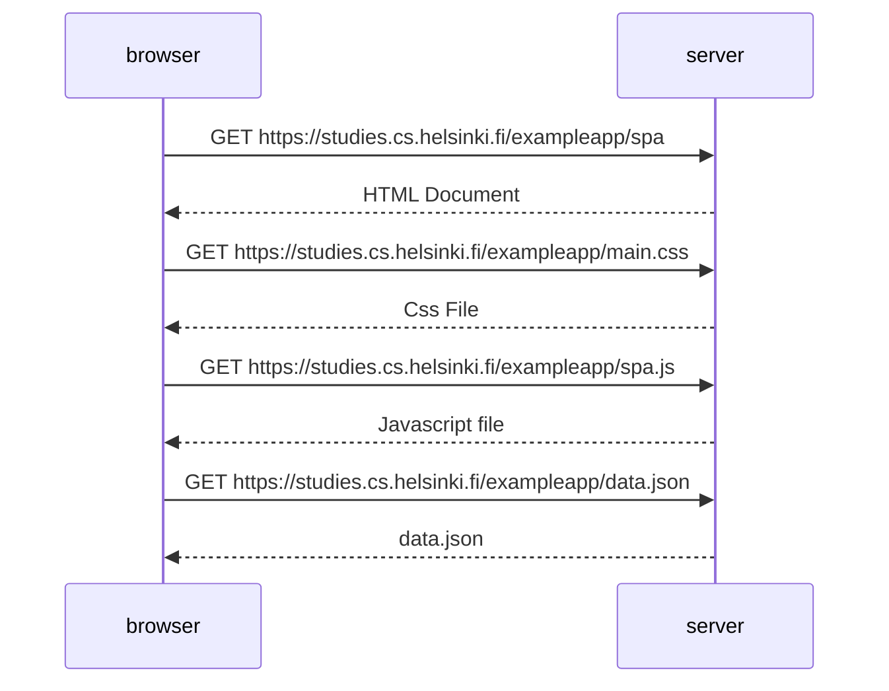
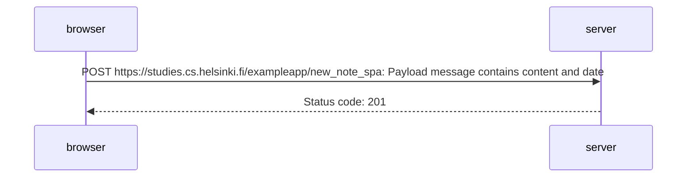

### Task 0.4

```mermaid 

    sequenceDiagram
        participant browser
        participant server
        
        browser->>server: POST https://studies.cs.helsinki.fi/exampleapp/new_notes;
        server-->>browser: Status code 302 response url:/exampleapp/notes;


        browser->>server: GET https://studies.cs.helsinki.fi/exampleapp/notes;
        server-->>browser: HTML Document;

        browser->>server: GET https://studies.cs.helsinki.fi/exampleapp/notes;
        server-->>browser: main.css;

        browser->>server: GET https://studies.cs.helsinki.fi/exampleapp/main.js;
        server-->>browser: main.js;

        
        browser->>server: GET https://studies.cs.helsinki.fi/exampleapp/data.json;
        server-->>browser: data.json;

```

### Task 0.5

```mermaid 

    sequenceDiagram
        participant browser
        participant server


        browser->>server: GET https://studies.cs.helsinki.fi/exampleapp/spa;
        server-->>browser: HTML Document;


        browser->>server: GET https://studies.cs.helsinki.fi/exampleapp/main.css;
        server-->>browser: Css File;

        browser->>server: GET https://studies.cs.helsinki.fi/exampleapp/spa.js;
        server-->>browser: Javascript file;

        browser->>server: GET https://studies.cs.helsinki.fi/exampleapp/data.json;
        server-->>browser: data.json;

```

### Task 0.6

```mermaid 

    sequenceDiagram
        participant browser
        participant server


        browser->>server: POST https://studies.cs.helsinki.fi/exampleapp/new_note_spa: Payload message contains content and date;
        server-->>browser: Status code: 201;
```